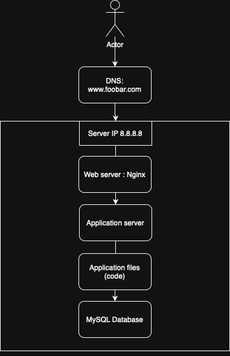

# 0. Simple Web Stack

## Overview

This infrastructure includes:
- Domain name: `www.foobar.com`
- DNS A record pointing to IP `8.8.8.8`
- One server with:
  - Nginx (web server)
  - Application server (e.g., Flask, Node.js)
  - Application files (HTML, JS, backend code)
  - MySQL database

## Diagram

  

## Component Roles

- **Domain name**: Translates `www.foobar.com` into server IP.
- **DNS Record**: `A` record or `CNAME` for `www`.
- **Web Server (Nginx)**: Handles HTTP requests, serves static content.
- **Application Server**: Runs backend logic.
- **Application Files**: Contain all source code.
- **Database**: Stores data persistently.

## Network Communication

- **Protocol**: TCP/IP on port 80 (HTTP)

## Limitations

- Single Point of Failure (SPOF)
- Not scalable
- No fault tolerance or HTTPS
