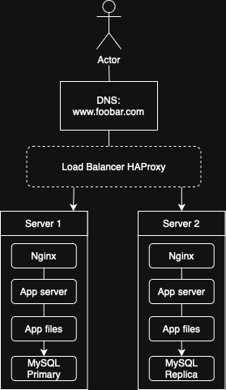

# 1. Distributed Web Infrastructure

## Overview

This infrastructure includes:
- Domain name: `www.foobar.com`
- DNS A/CNAME record pointing to Load Balancer IP
- Load Balancer (HAProxy) using **Round Robin**
- Two identical application servers:
  - Nginx
  - Application server
  - Application codebase
  - MySQL database (Primary/Replica)

## Diagram

  

## Component Roles

- **Load Balancer (HAProxy)**: Distributes traffic using Round Robin.
- **Server 1 & 2**:
  - Web Server: Nginx
  - Application Server: Runs business logic
  - Application Files: Website code
  - Database: Server 1 = Primary, Server 2 = Replica

## Load Balancing Logic

- **Round Robin**: each request is forwarded to the next server in a rotating list.
- **Active-Active setup**: both servers process requests in parallel.

## Database Redundancy

- **Primary**: handles all write operations.
- **Replica**: syncs from Primary, serves read queries.

## Issues & Limitations

- Load Balancer is still a SPOF (no failover yet).
- No firewall or HTTPS encryption.
- No monitoring tools in place.
