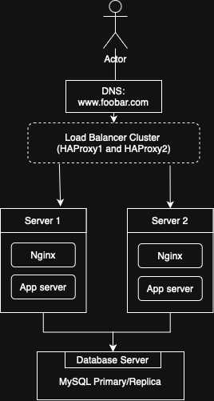

# 3. Scale Up

## Overview

This infrastructure scales up the previous design by:
- Splitting roles across multiple dedicated servers
- Adding a second load balancer in a cluster
- Eliminating remaining Single Points of Failure (SPOF)

## Components

- **2 Load Balancers (HAProxy)**: Clustered to ensure high availability.
- **Web Server(s)**: Nginx only; dedicated to handling HTTP requests.
- **Application Server(s)**: Run application logic separately.
- **Database Server(s)**:
  - Primary: Handles writes
  - Replica(s): Handle read-only queries

## Diagram

  

## Why This Design?

| Component | Justification |
|----------|----------------|
| LB Cluster | Redundancy – no SPOF |
| Split Roles | Better performance and scalability |
| Dedicated DB server | Centralized data layer, easy to monitor |
| Separate App servers | Reduce load on web servers |

## Concepts

- **SPOF**: removed via clustering and separation of concerns
- **Redundancy**: duplicated critical components
- **Scalability**: easier to add more servers by role
- **Modularity**: clearer maintenance and debugging paths

## Final Notes

This structure supports:
- Horizontal scaling (more servers per role)
- Better security isolation
- High availability
- Lower downtime during deployments
